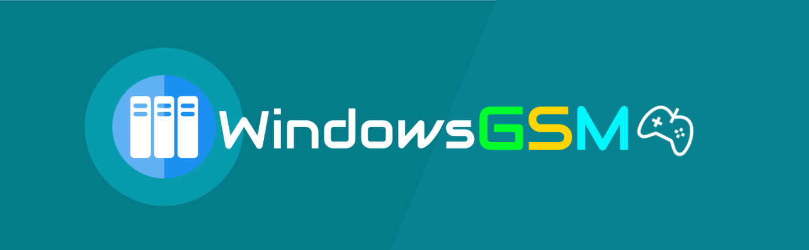
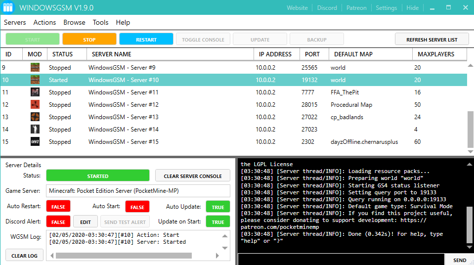

# Introduction

**WindowsGSM** - The best game server manager works on Windows platform, developed by [TatLead](https://github.com/BattlefieldDuck). He has 3 years game server management experience on Team Fortress 2 - [Doctor server](https://doctorserver.tatlead.com/) in both Linux and Windows Platform. This software is inspired by another superb project - [LinuxGSM\_](https://linuxgsm.com/) which is a command-line tool for quick, simple deployment and management of Linux dedicated game servers.







## Why should I use this software?

If you were a gamer or developer, you can create a server by just one-click install. The things that you need to do is enjoy your private server and start config your game server.

## Discord

Join our Discord server - [https://discord.gg/bGc7t2R](https://discord.gg/bGc7t2R)

